# Explainable AI-Based Phishing Email Detection and Risk Scoring System
## Implementation Plan

---

## 1. Genel Mimari

| Bileşen | Teknoloji |
|---------|-----------|
| Dil | Python 3.x |
| ML & Veri | scikit-learn, pandas, numpy |
| Dataset | Hugging Face `datasets` veya `requests` + `pandas` (`zefang-liu/phishing-email-dataset`) |
| Explainable AI | SHAP |
| Backend | FastAPI + uvicorn |
| UI | Tek sayfalık HTML/CSS/JS |
| Test | pytest |

---

## 2. Klasör ve Dosya Yapısı

```
phishing_ai_project/
├── phishing_ai/           # Python paketi
│   ├── __init__.py
│   ├── config.py
│   ├── data.py
│   ├── features.py
│   ├── models.py
│   ├── risk.py
│   └── explain.py
├── api/
│   ├── __init__.py
│   ├── config.py
│   ├── schemas.py
│   ├── dependencies.py
│   ├── routes.py
│   └── main.py
├── web/
│   ├── index.html
│   ├── styles.css
│   └── app.js
├── tests/
│   ├── test_data.py
│   ├── test_features.py
│   ├── test_models.py
│   ├── test_risk.py
│   └── test_api.py
├── scripts/               # Eğitim ve yardımcı scriptler
│   ├── train.py
│   └── download_dataset.py
├── models/                 # Kaydedilen model dosyaları (gitignore)
├── requirements.txt
├── README.md
├── PLAN.md
└── phishing_ai_project_document.md
```

---

## 3. Modül Sorumlulukları

### 3.1 `phishing_ai/config.py`
- Kritik kelime listesi: `verify, password, login, urgent, click here, account, security alert` vb.
- Risk skoru ağırlıkları: `w_prob=0.6`, `w_url=0.25`, `w_kw=0.15`
- Risk seviye eşikleri: Low (0–25), Medium (26–50), High (51–75), Critical (76–100)
- Model dosya yolları, TF-IDF parametreleri

### 3.2 `phishing_ai/data.py`
- Dataset yükleme, temizleme, train/test split
- Dataset hazırlığı sonrası `p_phishing_baseline` sütununu ekleme (öncü model ile)

### 3.3 `phishing_ai/features.py`
- Metin normalizasyonu (lowercase, temel temizlik)
- TF-IDF vektörizer tanımı (unigram/bigram, vocabulary sınırlamaları)
- Security feature çıkarımı: `url_count`, `has_url`, `keyword_count`

### 3.4 `phishing_ai/models.py`
- **Öncü model**: Baseline phishing classifier (Logistic Regression) → `p_phishing_baseline` üretir
- **Ana model**: TF-IDF + security features + `p_phishing_baseline` ile nihai phishing classifier
- Model karşılaştırması: Naive Bayes, Logistic Regression, Random Forest
- Model kaydetme/yükleme fonksiyonları

### 3.5 `phishing_ai/risk.py`
- `risk_score_0_100` hesaplama: `0.6*S_prob + 0.25*S_url + 0.15*S_kw`
- `S_prob = 100 * p_phishing_final`
- `S_url = min(100, 25 * url_count)`
- `S_kw = min(100, 20 * keyword_count)`
- `risk_level` belirleme: Low/Medium/High/Critical

### 3.6 `phishing_ai/explain.py`
- SHAP entegrasyonu (global ve lokal analiz)
- Tek e-posta için en önemli kelimeleri listeleyen fonksiyonlar

---

## 4. Veri ve Model Akışı

```mermaid
flowchart LR
    subgraph DataPrep [Veri Hazırlığı]
        DS[Dataset]
        Clean[Temizlik]
        Split[Train/Test Split]
    end
    
    subgraph Pioneer [Öncü Model]
        P1[TF-IDF + Security Features]
        P2[Logistic Regression]
        P3[p_phishing_baseline]
    end
    
    subgraph Main [Ana Model]
        M1[TF-IDF + Security + p_baseline]
        M2[Classifier]
        M3[p_phishing_final]
    end
    
    subgraph Risk [Risk Skoru]
        R1[S_prob, S_url, S_kw]
        R2[risk_score_0_100]
        R3[risk_level]
    end
    
    DS --> Clean --> Split
    Split --> P1 --> P2 --> P3
    P3 --> M1 --> M2 --> M3
    M3 --> R1 --> R2 --> R3
```



### Adım 1: Dataset Hazırlığı
- `zefang-liu/phishing-email-dataset` yükle
- Metin alanını seç, eksik/kısa satırları temizle
- Train/test split

### Adım 2: Öncü Model
- TF-IDF + security features ile Logistic Regression eğit
- Tüm dataset için `p_phishing_baseline` hesapla ve dataset'e ekle

### Adım 3: Ana Model
- Girdi: TF-IDF + security features + `p_phishing_baseline`
- Hedef: `label` (phishing/legitimate)
- Çıktı: `p_phishing_final`, binary karar

### Adım 4: Risk Skoru (inference sırasında)
- `S_prob`, `S_url`, `S_kw` hesapla
- `risk_score_0_100` ve `risk_level` belirle

---

## 5. Risk Skoru Formülü (Detaylı)

```
S_prob = 100 * p_phishing_final
S_url  = min(100, 25 * url_count)
S_kw   = min(100, 20 * keyword_count)

risk_score_0_100 = 0.6 * S_prob + 0.25 * S_url + 0.15 * S_kw

risk_level:
  0–25   → Low
  26–50  → Medium
  51–75  → High
  76–100 → Critical
```

---

## 6. API Tasarımı

### POST /analyze_email

**Request:**
```json
{
  "text": "E-posta metni buraya..."
}
```

**Response:**
```json
{
  "prediction": "phishing",
  "probability": 0.87,
  "risk_score": 79,
  "risk_level": "Critical",
  "risk_components": {
    "s_prob": 87,
    "s_url": 75,
    "s_kw": 60
  },
  "top_indicators": [
    {"word": "verify", "contribution": 0.18},
    {"word": "account", "contribution": 0.12},
    {"word": "urgent", "contribution": 0.09}
  ]
}
```

### GET /health
- Basit sağlık kontrolü

---

## 7. UI Tasarımı

- Tek sayfa: textarea + "Analyze" butonu
- Sonuç kartları:
  - Prediction (Phishing/Legitimate) + probability
  - Risk score (0–100) + risk level (renk kodlu)
  - Risk bileşenleri: S_prob, S_url, S_kw
  - Öne çıkan kelimeler listesi

---

## 8. Uygulama Sırası (Implementation Order)

1. **Proje iskeleti**: Klasörler, `requirements.txt`, `README.md`
2. **`phishing_ai/config.py`**: Sabitler ve konfigürasyon
3. **`phishing_ai/data.py`**: Dataset yükleme ve temizlik
4. **`phishing_ai/features.py`**: TF-IDF ve security feature çıkarımı
5. **`phishing_ai/models.py`**: Öncü model + ana model eğitimi
6. **`phishing_ai/risk.py`**: Risk skoru hesaplama
7. **`phishing_ai/explain.py`**: SHAP entegrasyonu
8. **`scripts/train.py`**: Eğitim pipeline'ı (script)
9. **`api/`**: FastAPI uygulaması
10. **`web/`**: HTML/CSS/JS arayüzü
11. **`tests/`**: Unit ve entegrasyon testleri

---

## 9. Açıklanabilirlik (Explainability)

- **Bileşen bazlı**: S_prob, S_url, S_kw değerleri ve formülün açık gösterimi
- **Kelime bazlı**: SHAP ile ana modele en çok katkı veren kelimeler
- UI ve raporda her ikisi de gösterilecek
